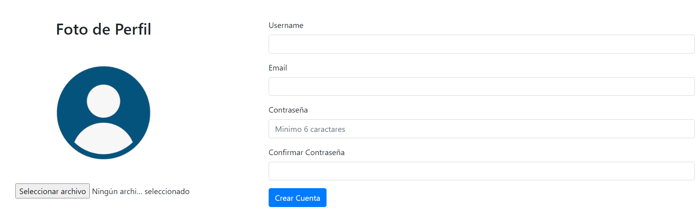
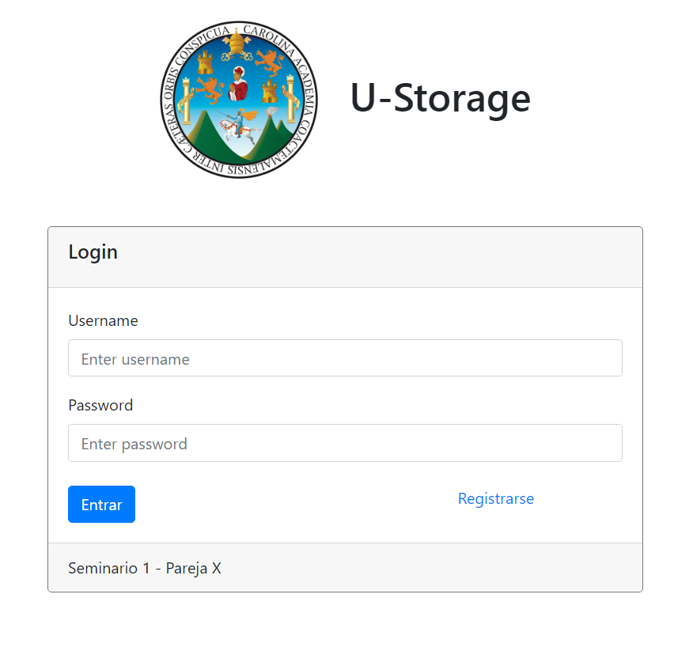
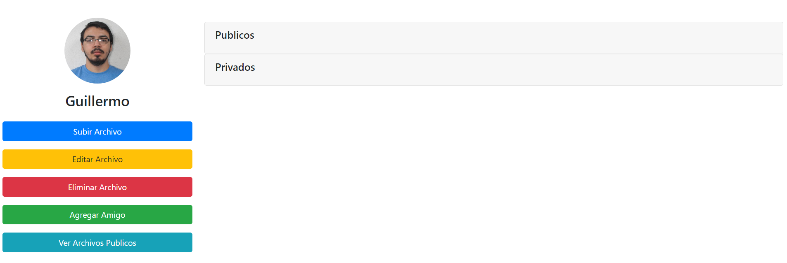
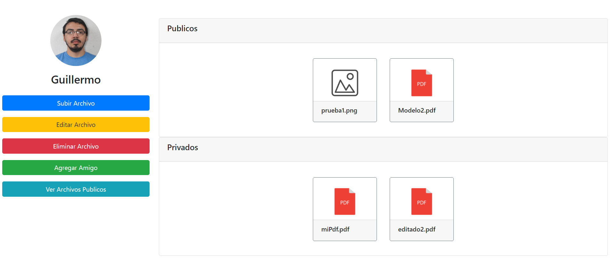
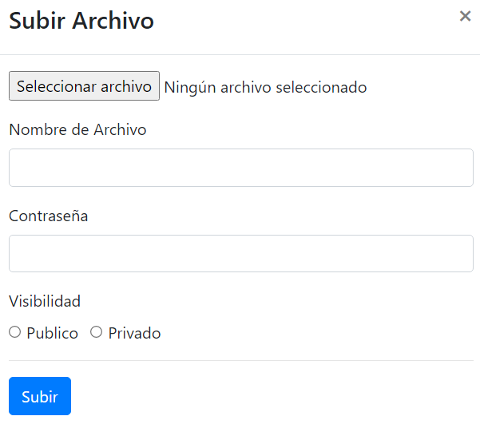
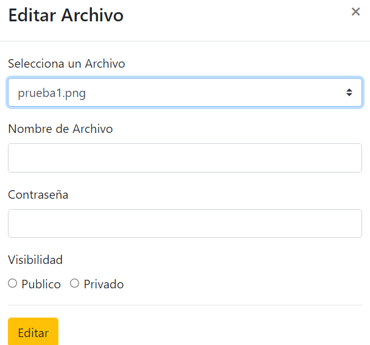
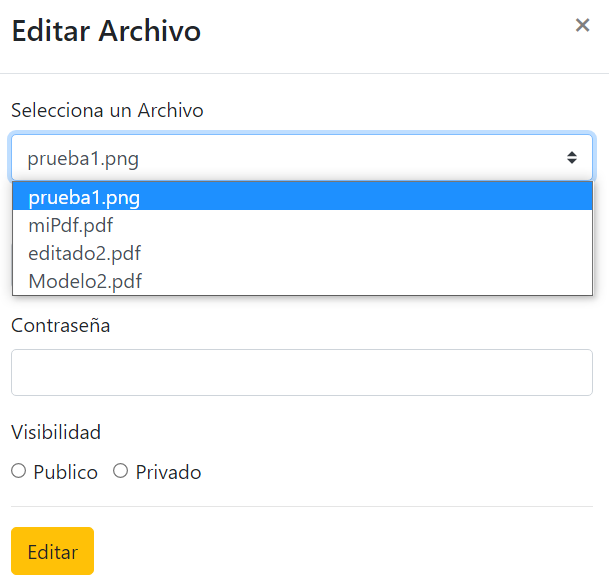
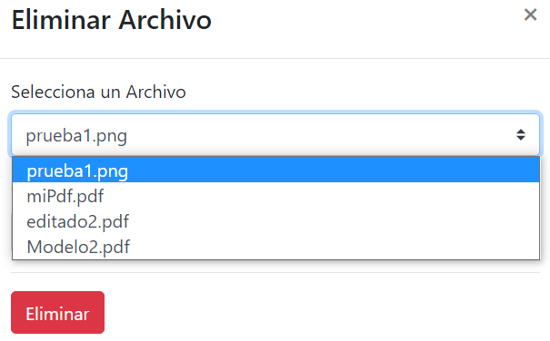
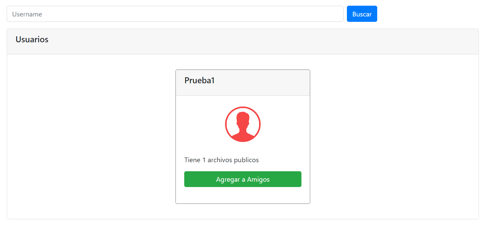
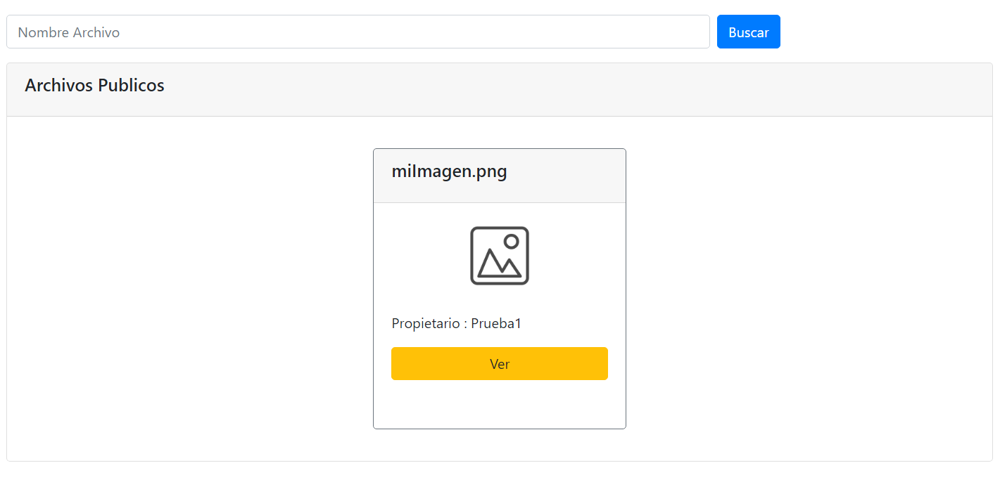

# SEMI1_PROYECTO1_2S2021

## Manual de Usuario

### Objetivos
<ul>
  <li>Desarrollar una aplicación donde se peudan compartir archivos de manera fácil y que sea accesible desde cualquier dispositivo. </li>
  <li>Brindar un espacio seguro y privado en donde se puedan almacenar archivos y compartirlos solo con las personas que deseas.</li>
</ul>

### U-Storage

U-storage es una aplicación destinada al almacenamiento y a la distribución controlada de archivos. Brindando acceso desde cualquier dispositivo con conexión a internet, se tiene una plataforma la cual cuenta con una forma segura de acceso y se adapta a cualquier dispositivo en el que se desee visualizar ya que tiene un diseño sensible.

En U-Storage puedes subir los archivos que desees almacenar, estos pueden ser almacenados como archivos públicos y privados, pero no te preocupes ya que tus archivos no son públicos para todo el mundo. Los archivos úblicos solo serán visibles para los usuarios que se tengan agregados como amigos, mientras 6que los priavos solo serán visibles para el usuario que los subió.

Los archivos pueden ser renombrados, cambiados de nivel de privacidad y eliminados de la plataforma de firma sencilla, esto nos permite utilizar la plataforma como un almacen o solo como un método de difusión a un grupo controlado de personas.

Puedes ingresar a la plataforma desde el siguiente enlace:
<a href="http://appweb-13-p1-semi1.s3-website.us-east-2.amazonaws.com/#/login">U-storage</a>

### Tutorial con capturas

#### Registro

  Para crear una cuenta se debe de llenar el siguiente formulario, en este se puede subir una foto de perfil la cual nos permite personalizar más nuestro perfil y que nos reconozcan más fácil.

   
  

#### Login

  En el login se debe de ingresar las credenciales de tu cuenta, de ser bien ingresadas se redireccionará al tablero en donde se puede manejar los archivos y a tus amigos.

   
  

#### Tablero

  En el siguiente tablero podemos ver las diferentes opciones de lado izquierdo para poder administrar nuestro archivos y relaciones de amistad, así como de lado derecho podemos ver 2 paneles que se contraen en los cuales podemos visualizar nuestroa archivos divididos por su nivel de privacidad.

<table align="center" width="100%">
    <tr>
        <td>
            
        </td>
    </tr>
    <tr>
        <td>
            
        </td>
    </tr>
</table>

#### Subir Archivos

  Para subir un archivo se debe completar el siguiente formulario, en este se escoge el archivo que se cargará así como su nombre y su nivel de privacidad.

<table align="center" width="100%">
    <tr>
        <td>
            
        </td>
    </tr>
</table>

#### Editar Archivos

  Se puede editar el nombre de los archivos y su nivel de privacidad desde el siguiente formulario, este tiene una lista de selección lo cual permite que se más fácil seleccionar al archivo que se le desean hacer lo cambios.

<table align="center" width="100%">
    <tr>
        <td>
            
        </td>
        <td>
            
        </td>
    </tr>
</table>

#### Eliminar Archivos

  Se pueden eliminar los archivos, este proceso así como los anteriores relacionados con el manejo de archivos utiliza la contraseña de la cuenta como mediad de seguridad. Se tiene una lista desplegable desdes la cual se debe de seleccionar el archivo a elminar.

<table align="center" width="100%">
    <tr>
        <td>
            
        </td>
        <td>
            
        </td>
    </tr>
</table>

#### Agregar Amigos

    En esta sección se pueden seleccionar se muestran los perfiles de los otros usuarios de la plataforma, desde esta vista podemos buscar usuarios o ver a los que se nos muestran y agrgarlos como amigos para poder ver y compartir archivos.

<table align="center" width="100%">
    <tr>
        <td>
            
        </td>
    </tr>
</table>

#### Archivos Públicos

  En esta vista se pueden ver los distintos archivos públicos de todas las cuentas que tenemos agregadas como amigas, también se puede realizar una búsqueda de archivos por nombre para que sea más fácil encontrar el archivo deseado.

<table align="center" width="100%">
    <tr>
        <td>
            
        </td>
    </tr>
</table>

## Manual Técnico